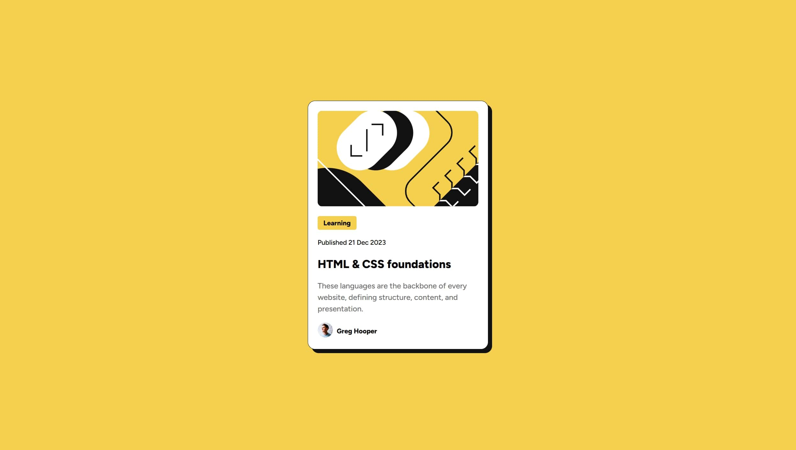

# Frontend Mentor - Blog preview card solution

This is a solution to the [Blog preview card challenge on Frontend Mentor](https://www.frontendmentor.io/challenges/blog-preview-card-ckPaj01IcS). Frontend Mentor challenges help you improve your coding skills by building realistic projects.

## Table of contents

- [Overview](#overview)
  - [The challenge](#the-challenge)
  - [Screenshot](#screenshot)
  - [Links](#links)
- [My process](#my-process)
  - [Built with](#built-with)
  - [What I learned](#what-i-learned)
  - [Continued development](#continued-development)
  - [Useful resources](#useful-resources)
- [Author](#author)
- [Acknowledgments](#acknowledgments)

**Note: Delete this note and update the table of contents based on what sections you keep.**

## Overview

### The challenge

Users should be able to:

- See hover and focus states for all interactive elements on the page

### Screenshot

### Links

- Solution URL: [Add solution URL here](https://your-solution-url.com)
- Live Site URL: https://dangduomg.github.io/learning-web/blog-preview-card-main/

## My process

### Built with

- Semantic HTML5 markup
- CSS custom properties
- Flexbox

### What I learned

- Using pseudo-classes in CSS
- Using custom properties in CSS

### Continued development

No ideas yet :)

### Useful resources

Obviously, these two are indispensable:

- [MDN HTML documentation](https://developer.mozilla.org/en-US/docs/Web/HTML)
- [MDN CSS documentation](https://developer.mozilla.org/en-US/docs/Web/CSS)

## Author

- Frontend Mentor - [@dangduomg](https://www.frontendmentor.io/profile/dangduomg)

## Acknowledgments

- [Frontend Mentor](https://www.frontendmentor.io/), for providing the design and resources, of course
