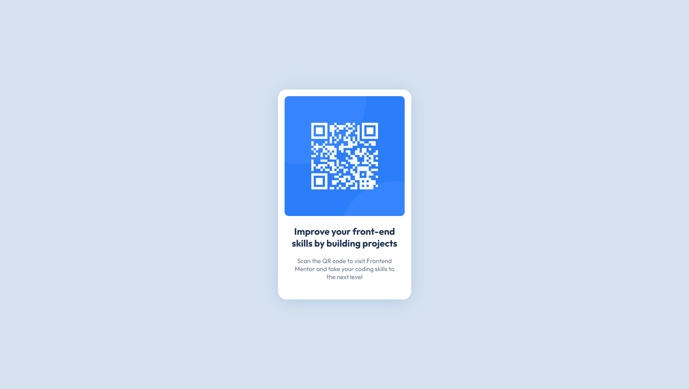

# Frontend Mentor - QR code component solution

This is a solution to the [QR code component challenge on Frontend Mentor](https://www.frontendmentor.io/challenges/qr-code-component-iux_sIO_H). Frontend Mentor challenges help you improve your coding skills by building realistic projects.

## Table of contents

- [Overview](#overview)
  - [Screenshot](#screenshot)
  - [Links](#links)
- [My process](#my-process)
  - [Built with](#built-with)
  - [What I learned](#what-i-learned)
  - [Continued development](#continued-development)
  - [Useful resources](#useful-resources)
- [Author](#author)
- [Acknowledgments](#acknowledgments)

## Overview

### Screenshot

### Links

- Solution URL: https://www.frontendmentor.io/solutions/qr-code-box-with-flexbox-HhYV-QTK-8
- Live Site URL: https://dangduomg.github.io/learning-web/qr-code-component-main/

## My process

### Built with

- Semantic HTML5 markup
- Flexbox

### What I learned

- How to use semantic HTML and CSS (but mostly how to use CSS)
- How to use Developer Tools to debug and experiment by editing the webpage on-the-fly

### Continued development

- Add dark mode (Done)
- Add transitions

### Useful resources

Obviously, these two are indispensable:

- [MDN HTML documentation](https://developer.mozilla.org/en-US/docs/Web/HTML)
- [MDN CSS documentation](https://developer.mozilla.org/en-US/docs/Web/CSS)

## Author

- Frontend Mentor - [@dangduomg](https://www.frontendmentor.io/profile/dangduomg)

## Acknowledgments

- [Frontend Mentor](https://www.frontendmentor.io/), for providing the design and resources, of course
